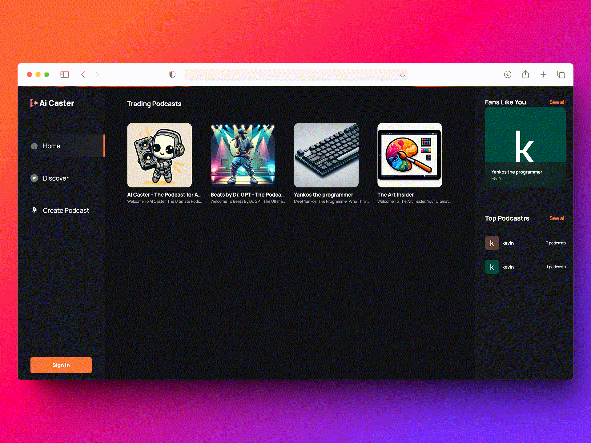

# AI CASTER

>This repository is a project to demonstrate my capabilities in creating full-stack applications using best practices and the most optimal libraries to turn an idea/proof of concept into reality.

>AI-Caster is an application that allows you to create, generate, and listen to podcasts with the help of AI.

## Technologies
For this project, I have used:
- Next.js: to create and deploy the full-stack application
- Bun: for faster development
- Clerk: for user management and authentication
- Convex: as backend as a service to manage users, authentication, storage, and saving podcasts
- Zod: for data validation on both the client and server
- TypeScript
- shadcn/Tailwind CSS: to use modern and beautiful components
- OpenAI GPT: for text and image generation
